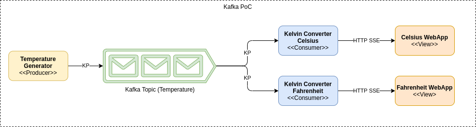

# kafka-quarkus-js
An example of Kafka with [Quarkus](https://quarkus.io) as producer, [Quarkus](https://quarkus.io) as consumers SSE streaming to EventSource JavaScript

## Architecture

The ideia is to publish Kelvin temperatures in the "temperature" Kafka Topic, then start two instances of the consumer project one to consume and convert from Kelvin to Celsius and the other to consume and convert from Kelvin to Fahrenheit.

After running the scripts described below, two Web Apps will be available one at http://0.0.0.0:8082/ and the other at http://0.0.0.0:8083/

The consumer app is configured in application.properties where the name of the temperature and the formula to convert from Kelvin are set.

There is an internal stream of Kelvin values inside the consumer app published in an JAX-RS endpoint as SSE - Server-Sent (text/event-stream).

Finally the consumer app contains a Web App made with Bootstrap, JQuery and vanila EventSource Java Script to consume from a SSE endpoint and print in HTML.




## Environment Requirements
This example requires [Docker](https://docs.docker.com/get-docker/) and [Docker Compose ](https://docs.docker.com/compose/)pre-installed.

## Kafka

### Start Kafka
To initialize the Kafka stack run start-kafka.sh script.

### Stop Kafka
To terminate the Kafka stack run stop-kafka.sh script.

## Running The Producer
Start the producer by running this command
```
kafka-producer/kelvin.sh
```

## Running The Consumers
```
kafka-consumer/celsius.sh
kafka-consumer/fahrenheit.sh
```

[Access Consumer in Celsius](http://0.0.0.0:8082/)

[Access Consumer in Fahrenheit](http://0.0.0.0:8083/)
